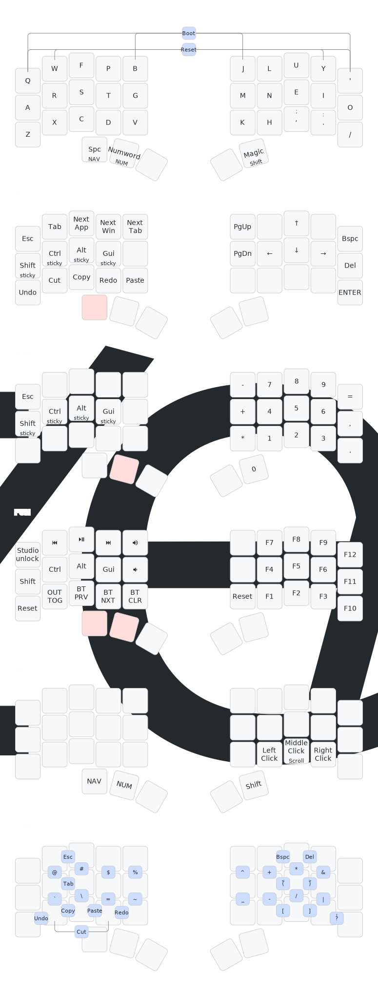

# ZMK Charybdis Keyboard Firmware

A custom ZMK firmware configuration for the [BastardKB Charybdis Nano](https://github.com/bastardkb/charybdis/) split keyboard with trackball. This project provides a complete firmware setup for building and customizing your Charybdis keyboard.

## ⌨️ Keymap Layout

The keyboard uses a 5-column layout with 5 layers:

### Base Layer

- Standard Colemak-dhm layout

### Navigation Layer

- Arrow keys
- Navigation keys (Home, End, Page Up/Down)
- Modifier keys

### Symbols Layer

- Symbols keys most of them handled in the right side

### Numbers Layer

- Number pad layout

### Functional Layer

- Volume controls
- F-N keys
- System reset for halves

### Combos

- Optimized for right-handed trackball usage (left, middle, right clicks and scrolling)
- Bootloader and reset for the dongle
- Caps word

## 🔧 Dependencies

This project uses these three ZMK modules:

- **zmk-pmw3610-driver**: Custom trackball driver
- **zmk-tri-state**: Enhanced key behavior support
- **zmk-dongle-display**: Display module for connection status

## 🙏 Acknowledgments

- [BastardKB](https://github.com/bastardkb/) for the Charybdis design
- [ZMK Firmware](https://zmk.dev/) for the keyboard firmware
- [keymap-drawer](https://github.com/caksoylar/keymap-drawer) for layout visualization
